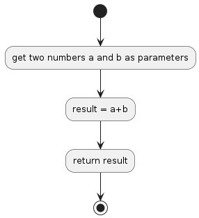

# P01

## Return the Sum of Two Numbers
Create a function that takes two numbers as arguments and returns their sum.

## Algorithm Diagram

## Resourse
[https://edabit.com/challenge/3LpBLgNRyaHMvNb4j](https://edabit.com/challenge/3LpBLgNRyaHMvNb4j)

