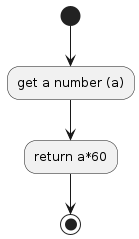

# P02

## Convert Minutes into Seconds
Write a function that takes an integer minutes and converts it to seconds.

## Algorithm Diagram

## Resource
[https://edabit.com/challenge/8q54MKnRrm89pSLmW](https://edabit.com/challenge/8q54MKnRrm89pSLmW)