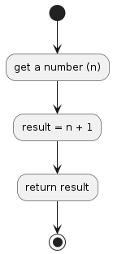

# P03

## Return the Next Number from the Integer Passed
reate a function that takes a number as an argument, increments the number by +1 and returns the result.

## Diagram algorithm

## Resource
[https://edabit.com/challenge/NAQhEoxbofPidLxm9](https://edabit.com/challenge/NAQhEoxbofPidLxm9)