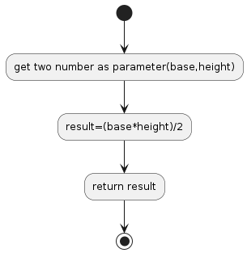

# P04

## Area of a Triangle
Write a function that takes the base and height of a triangle and return its area.

## Diagram Algorithm

## Resourse
[https://edabit.com/challenge/3CaszbdZYGN4otQD8](https://edabit.com/challenge/3CaszbdZYGN4otQD8)