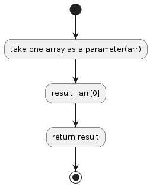

## p06

## Return the First Element in an Array
Create a function that takes an array containing only numbers and return the first element.

## Algorithm Diagram

## Resource
[https://edabit.com/challenge/QaApgtePE6QrCZ64o](https://edabit.com/challenge/QaApgtePE6QrCZ64o)