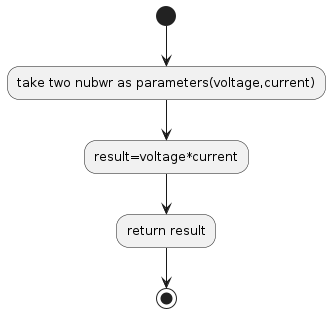

## P07

## Power Calculator
Create a function that takes voltage and current and returns the calculated power.

## Diagram algorithm

## Resource
[https://edabit.com/challenge/wAdE9te55cowBLcPs](https://edabit.com/challenge/wAdE9te55cowBLcPs)
