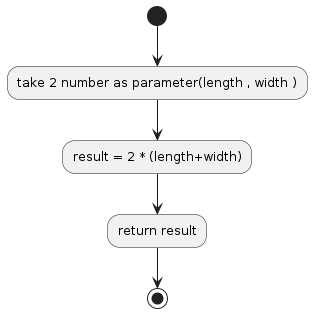

## P09

## Find the Perimeter of a Rectangle
Create a function that takes length and width and finds the perimeter of a rectangle.

## Algorithm Diagram

## Resource 
[https://edabit.com/challenge/XnJ24rWW7iJkNrtsh](https://edabit.com/challenge/XnJ24rWW7iJkNrtsh)