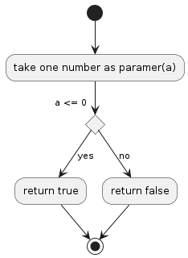

## P10

## Is the Number Less than or Equal to Zero?
Create a function that takes a number as its only argument and returns true if it's less than or equal to zero, otherwise return false.

## Algorithm Diagram

## Resource
[https://edabit.com/challenge/PTiLYyb4A69KZtBCg](https://edabit.com/challenge/PTiLYyb4A69KZtBCg)